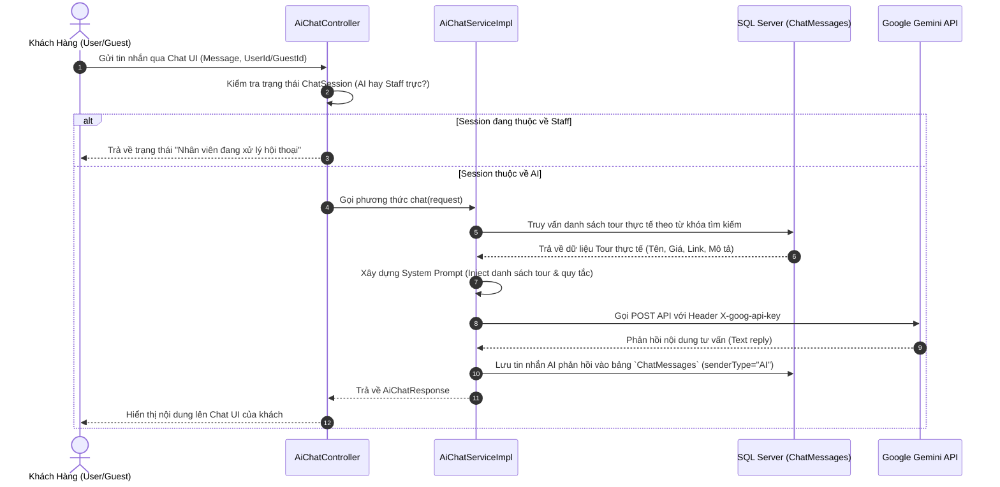

# AI Integration & Audit Logging System (TourBooking Enterprise)

Tài liệu này trình bày chi tiết về kiến trúc tích hợp Trí tuệ Nhân tạo (AI), thiết kế cơ sở dữ liệu nhật ký kiểm toán (AI Audit Log), và quy trình vận hành thực tế của hệ thống AI Chatbot trong dự án TourBooking.

---

## 1. Tổng Quan Hệ Thống AI (System Overview)

Hệ thống TourBooking sử dụng mô hình ngôn ngữ lớn **Google Gemini API** (phiên bản `gemini-flash-latest`) để cung cấp giải pháp **AI Travel Consultant** (Tư vấn viên du lịch ảo). Hệ thống được thiết kế để tự động hóa khâu chăm sóc khách hàng ban đầu, tìm kiếm và gợi ý tour theo thời gian thực dựa trên nhu cầu của khách hàng trước khi chuyển giao cho nhân viên trực chat (Chat Escalation).

### Các Tính Năng Cốt Lõi của AI:
- **Tư vấn thông minh ngữ cảnh (Contextual Recommendation):** AI không chỉ trả lời tự do mà được cung cấp dữ liệu tour thực tế lấy từ cơ sở dữ liệu (`TourRepository`) để đảm bảo thông tin chính xác 100% về giá tiền, địa điểm, và link đặt tour.
- **Hỗ trợ đa đối tượng:** Nhận diện người dùng đã đăng nhập (`UserID`) và khách vãng lai (`GuestId`) để cá nhân hóa cuộc hội thoại.
- **Tự động chuyển giao (Chat Escalation Handover):** Nhận diện từ khóa có nhu cầu gặp người trực chat (ví dụ: *"nhân viên"*, *"hỗ trợ"*, *"gặp người"*) để tạm ngắt AI và chuyển tiếp đến nhân viên.

---

## 2. Kiến Trúc AI Audit Log (Database Schema)

Mọi hoạt động tương tác với AI đều được ghi vết và lưu trữ tập trung vào bảng cơ sở dữ liệu `ChatMessages`. Đây chính là **AI Audit Log** cho phép quản trị viên giám sát chất lượng và tính tuân thủ của AI.

### Mô hình Entity `ChatMessages`:
```java
@Entity
@Table(name = "ChatMessages")
public class ChatMessages extends Base {
    
    @ManyToOne(fetch = FetchType.LAZY)
    @JoinColumn(name = "UserID")
    private User user;            // Gắn với tài khoản nếu đã đăng nhập

    @Column(name = "SenderType", length = 20)
    private String senderType;    // Phân loại: "USER" hoặc "AI" hoặc "STAFF"

    @Column(name = "Message", columnDefinition = "NVARCHAR(MAX)")
    private String message;       // Nội dung câu hỏi của khách hoặc phản hồi của AI

    @Column(name = "GuestId", length = 50)
    private String guestId;       // UUID định danh phiên chat của khách vãng lai

    @Column(name = "SentAt")
    private LocalDateTime sentAt; // Thời gian ghi nhận tin nhắn
}
```

### Mục Tiêu Kiểm Toán Công Nghiệp (Industrial Auditing Objectives):
1. **Theo dõi chất lượng phản hồi (Response Quality Control):** Kiểm tra xem AI có trả lời đúng sự thật không, có vi phạm nguyên tắc hệ thống (bịa đặt thông tin tour) hay không.
2. **Kiểm tra tuân thủ (Compliance Auditing):** Đảm bảo AI luôn tuân thủ Prompt hệ thống: sử dụng tiếng Việt, thân thiện, đính kèm đúng link chi tiết tour, hiển thị giá tiền chính xác.
3. **Phân tích hành vi khách hàng (User Intent Analysis):** Thu thập dữ liệu từ các từ khóa khách hàng tìm kiếm để tối ưu hóa chiến lược Marketing và sản phẩm tour.
4. **Lịch sử hội thoại liên mạch (Seamless Handover):** Khi khách hàng yêu cầu chuyển tiếp sang nhân viên trực chat, nhân viên có thể đọc lại toàn bộ **AI Audit Log** trước đó để nắm bắt nhu cầu mà không cần bắt khách hàng lặp lại câu hỏi.

---

## 3. Quy Trình Vận Hành & Luồng Dữ Liệu (Data Flow)

Luồng hoạt động từ lúc người dùng gửi tin nhắn đến khi ghi nhận Audit Log diễn ra như sau:



---

## 4. Quá Trình Phát Triển & Logic Ổn Định Dự Án (Development Logic)

Hệ thống AI Chat và Audit Log trong dự án được triển khai qua các giai đoạn nghiêm ngặt để đảm bảo sự ổn định của môi trường production:

### Giai đoạn 1: Thiết kế Cơ chế RAG cơ bản (Retrieval-Augmented Generation)
- Nhận thấy việc để AI tự do trả lời sẽ dẫn đến hiện tượng **Hallucination** (ảo tưởng - bịa ra các địa điểm và giá tiền không có thật).
- Hệ thống áp dụng RAG: trước khi chuyển tin nhắn tới Gemini, hệ thống tự động bóc tách từ khóa (`extractKeyword`) từ câu hỏi của khách, thực hiện tìm kiếm trong CSDL bằng JPA (`tourRepo.searchToursWithFilters`), sau đó gắn trực tiếp dữ liệu tour tìm được vào prompt gửi đi.

### Giai đoạn 2: Tối ưu hóa Bảo mật và Cấu hình Môi trường (Security & Env Configuration)
- Tránh lộ khóa API của Gemini trên frontend hoặc lưu cứng trong mã nguồn (vi phạm chính sách bảo mật GitHub Push Protection).
- Tách biệt `gemini.api.key` và `gemini.api.url` ra file môi trường `.env` và gọi qua `@Value` ở phía Backend. Frontend chỉ gọi tới endpoint nội bộ `/api/v1/ai/chat`.

### Giai đoạn 3: Phân luồng AI và Nhân viên (Session Handover Logic)
- Xây dựng `ChatSessionStatus` gồm `AI` và `STAFF`.
- Nếu AI phát hiện câu hỏi mang tính chất khẩn cấp hoặc yêu cầu gặp người thực (`fallbackResponse`), hệ thống gợi ý nút bấm kết nối hỗ trợ.
- Một khi trạng thái chuyển sang hỗ trợ bởi nhân viên, controller sẽ khóa không cho AI trả lời tin nhắn mới của session đó nữa nhằm tránh việc AI gửi đè tin nhắn tranh chấp với nhân viên thực tế.

### Giai đoạn 4: Thiết lập Cơ chế Fallback và Xử lý Lỗi ngoại lệ (Robust Error Handling)
- Khi Gemini API quá tải hoặc mất kết nối mạng, hệ thống tự động kích hoạt `fallbackResponse` dựa trên cơ sở dữ liệu nội bộ để trả về các tour nổi bật, hoặc thông báo khách hàng kết nối trực tiếp tới nhân viên trực chat, đảm bảo trải nghiệm khách hàng không bị gián đoạn.

---

## 5. Hướng Dẫn Giám Sát và Đọc Audit Log (Auditing Operations)

Quản trị viên hoặc Trưởng nhóm hỗ trợ có thể thực hiện các câu lệnh SQL sau trên Database để trích xuất báo cáo về việc sử dụng AI:

### Báo cáo số lượng tin nhắn AI đã xử lý theo ngày:
```sql
SELECT CAST(SentAt AS DATE) as Date, COUNT(*) as TotalMessages
FROM ChatMessages
WHERE SenderType = 'AI'
GROUP BY CAST(SentAt AS DATE)
ORDER BY Date DESC;
```

### Xem các hội thoại khách hàng yêu cầu chuyển tiếp nhân viên (Cần cải thiện Prompt):
```sql
SELECT UserID, GuestId, Message, SentAt
FROM ChatMessages
WHERE SenderType = 'USER'
  AND (Message LIKE N'%nhân viên%' OR Message LIKE N'%hỗ trợ%' OR Message LIKE N'%gặp người%')
ORDER BY SentAt DESC;
```

### Trích xuất lịch sử trò chuyện của một phiên khách hàng cụ thể để kiểm tra chất lượng AI:
```sql
SELECT SenderType, Message, SentAt
FROM ChatMessages
WHERE UserID = 123 OR GuestId = 'guest-session-uuid-xyz'
ORDER BY SentAt ASC;
```

---

## 5. Hướng Dẫn Sử Dụng AI (AI Usage Guide)

### A. Đối với Khách Hàng & Khách Vãng Lai (Customer Experience)
1. **Mở Hộp Thoại Chat:**
   - Người dùng đăng nhập hoặc truy cập dưới dạng khách vãng lai (Guest), sau đó nhấn vào biểu tượng bong bóng Chat ở góc màn hình.
   - Trợ lý AI sẽ hiển thị lời chào chủ động (Proactive Greeting): *"👋 Xin chào! Tôi là trợ lý tư vấn tour du lịch của Dana..."*
2. **Giao Tiếp & Tìm Kiếm Tour:**
   - **Tìm kiếm theo vị trí:** Nhập *"Tôi muốn đi du lịch Bà Nà Hills"* hoặc *"Có tour nào ở Đà Nẵng không?"*. AI sẽ tự động tách từ khóa, tìm kiếm trong database nội bộ và liệt kê các tour kèm link chính xác.
   - **Tư vấn theo tiêu chuẩn:** Nhập *"Tư vấn tour phù hợp trẻ em dưới 5 tuổi"*. AI sẽ đọc trường chính sách trẻ em (`childPolicy`) của các tour để đưa ra lời khuyên.
3. **Yêu cầu hỗ trợ trực tiếp:**
   - Người dùng gõ tin nhắn chứa các từ khóa như *"gặp nhân viên"*, *"hỗ trợ"*, *"gặp người thực"* hoặc click trực tiếp vào nút **"Kết nối với nhân viên"** trên giao diện chat.

### B. Đối với Nhân Viên Hỗ Trợ (Staff & Admin Experience)
1. **Theo Dõi Danh Sách Chờ Chuyển Giao (Escalation Queue):**
   - Nhân viên đăng nhập tài khoản và truy cập trang **Quản lý chuyển tiếp chat** (`/pages/admin/chat-escalations.html` hoặc `/pages/staff/chat-escalations.html`).
   - Giao diện sẽ hiển thị các phiên chat của khách hàng đang đợi hỗ trợ (`WAITING_STAFF`).
2. **Đọc Nhật Ký AI Audit Log Trực Quan (UI Chat History):**
   - Click vào phiên chat cần xử lý.
   - Nhân viên có thể đọc lại toàn bộ nội dung trò chuyện trước đó giữa khách hàng và AI để hiểu ngay mong muốn của khách (họ đã tìm kiếm địa điểm nào, xem những tour nào) trước khi chính thức tiếp quản cuộc trò chuyện.
3. **Tiếp Nhận Chat:**
   - Khi nhân viên gửi tin nhắn phản hồi đầu tiên, trạng thái phiên chuyển sang `STAFF_CHATTING`. Hệ thống sẽ **tự động ngắt AI** của phiên đó để nhân viên trực tiếp trao đổi với khách hàng, tránh việc AI phản hồi chồng chéo.

### C. Đối với Lập Trình Viên (Developer API Integration)
Hệ thống frontend giao tiếp với AI chatbot thông qua HTTP REST API:
- **Endpoint:** `POST /api/v1/ai/chat`
- **Headers:** `Content-Type: application/json`
- **Request Body:**
  ```json
  {
    "message": "Cho tôi xem tour đi Hội An",
    "userId": 12,
    "guestId": null
  }
  ```
- **Response Body:**
  ```json
  {
    "code": 201,
    "message": "AI chat response",
    "data": {
      "reply": "🤖 Chào bạn! Dưới đây là tour phù hợp:\n\n🌟 **Tour Ngũ Hành Sơn - Hội An**\n💰 Giá: 1,200,000 VND | ⏱ 1 ngày\n📍 Đà Nẵng → Hội An\n🔗 [xem thêm tại đây](http://localhost:3000/pages/tour-detail.html?id=5)"
    }
  }
  ```

---

## 6. Định Hướng Nâng Cấp Hệ Thống Audit Log

Trong các phiên bản tiếp theo, hệ thống AI Audit Log sẽ được bổ sung các tính năng cấp doanh nghiệp sau:
1. **Lưu vết Token Usage:** Lưu trữ số lượng token đã tiêu thụ (Input tokens, Output tokens) trên mỗi câu hỏi vào bảng Audit Log để giám sát chính xác chi phí API hàng tháng.
2. **Phân tích Cảm xúc (Sentiment Analysis):** AI tự động phân tích thái độ của khách hàng (Tích cực, Trung lập, Tiêu cực) thông qua nội dung tin nhắn và lưu vào log, giúp cảnh báo sớm cho nhân viên nếu khách hàng đang giận dữ.
3. **Dashboard Trực Quan (AI Analytics Dashboard):** Xây dựng giao diện biểu đồ cho admin thống kê tỉ lệ giải quyết vấn đề thành công của AI chatbot, tỉ lệ chuyển giao nhân viên, và các chủ đề tour được quan tâm nhất.

